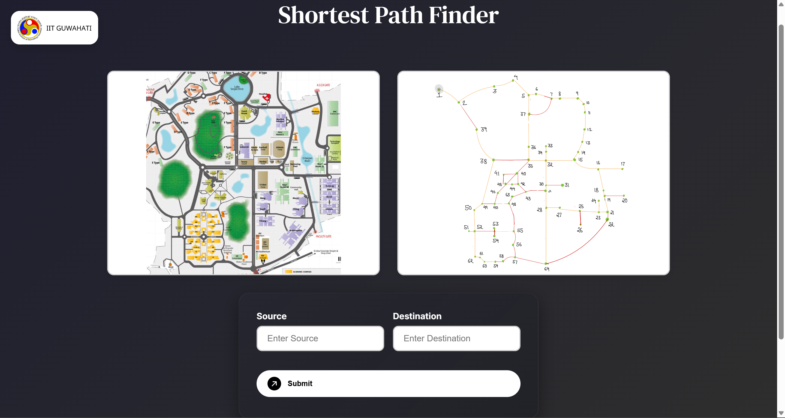

# 🧩 Shortest Path Visualizer

An interactive **web app** that visualizes the **shortest path** between two points on a **campus-like map** using **Dijkstra’s algorithm**. This project helped me deepen my understanding of **graph traversal**, **optimization algorithms**, and **full-stack deployment workflows**.

[🌐 **Live Site**](https://shortest-path-finder-iitg.netlify.app) | [🔌 **API Endpoint**](https://shortest-path-finder-3tv3.onrender.com)

---

## 🚀 Features

- 🗺️ **Interactive campus-style map** where users can choose any two nodes as source and destination  
- ⚡ **Real-time visualization** of the shortest path computed using Dijkstra’s algorithm  
- 📏 **Instant display of total distance and route path** in a clean, responsive UI  
- 🌐 **Fully deployed, full-stack setup** — React frontend (Netlify) + Flask backend (Render)  
- 🧠 Built to replicate **real-world navigation systems** using graph theory and pathfinding algorithms  

---

## 🛠 Tech Stack

| **Frontend**       | **Backend**        | **Deployment & Tools**     |
|--------------------|--------------------|-----------------------------|
| React              | Flask (Python)     | Netlify                     |
| HTML, CSS          | Flask-CORS         | Render                      |
| JavaScript         | REST API           | Git & GitHub                |

---

## 📸 Preview

<p align="center">
  
</p>

---

## 🧱 How to Clone and Run Locally

### 1. Clone the repository:
```bash
git clone https://github.com/tanishapatel23/shortest_path_finder.git
cd shortest_path_finder
```

### 2. Set up and run the backend (Flask):
```bash
python -m venv venv
source venv/bin/activate   # On Windows: venv\Scripts\activate
pip install -r requirements.txt
python server.py
```

### 3. Set up and run the frontend (React):
```bash
npm install
npm start
```

Your app should now be running at: [http://localhost:3000](http://localhost:3000) 🚀

---

## 🔧 Future Improvements

- 🧭 Add support for real-time, step-by-step path animation  
- 🛵 Animate a bike icon smoothly moving along the computed shortest path  
- 🏷️ Add human-readable names to nodes (e.g., "Library", "Hostel A") for better usability  
- 🗺️ Integrate zoom and pan controls for better map navigation  
- 🛣️ Allow multiple route options and weighted paths  
- 🎨 Add dark mode and theming support  
- 📱 Make the app fully responsive for mobile and tablet devices  
- 🌐 Support dynamic map uploads and custom node creation  

---

## 🙋‍♂️ Made with logic and caffeine by Tanisha Patel
